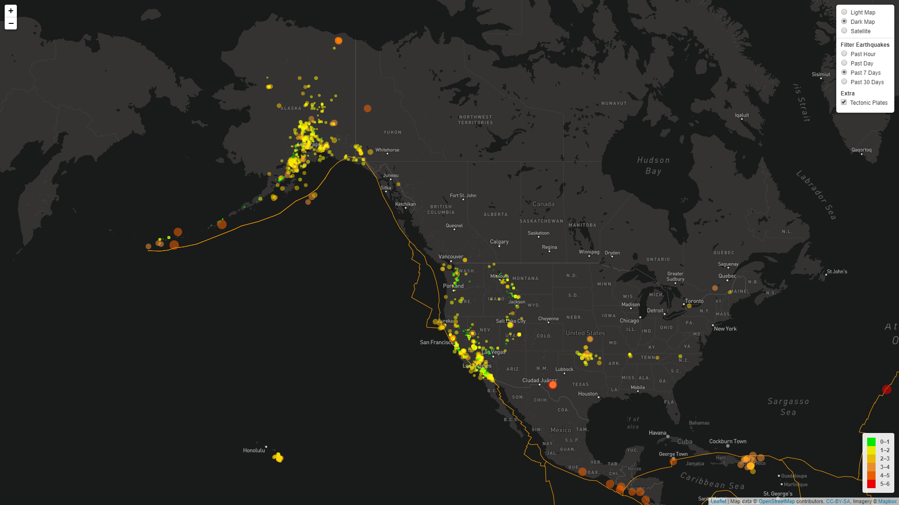

# Earthquake Map Visualizer
Visualizing earthquakes in North Americausing United States Geological Survey within the last 30 days, 7 days, day, and hour.

## Getting Started
### Prerequisites
- A browser
- MapBox API Key (https://www.mapbox.com/)

### Instructions
1. Clone repo.
2. Create `config.js` inside `static/js/`. This is where you will put your MapBox API Key as formatted below.
    a. `API_KEY = 'api key goes here'`
3. Open index.html in a browser and you're done!

## Built With
This Earthquake Visualizer uses the following:
- D3 - Used to send requests to API
- HTML - Render the website
- CSS - Styling
- Javascript - to create functions for interactive maps
- Leaflet - used create interactive maps
- MapBox - Map raster layers (dark, light, satellite)
- [Leaflet Grouped Layer Control](https://github.com/ismyrnow/leaflet-groupedlayercontrol) - for a Cleaner Layer Control
- [Data from USGS](https://earthquake.usgs.gov/earthquakes/feed/v1.0/geojson.php) - Data from last 30 days, 7 days, day, and hour.

## Contact
David Nguyen - david@knytes.com